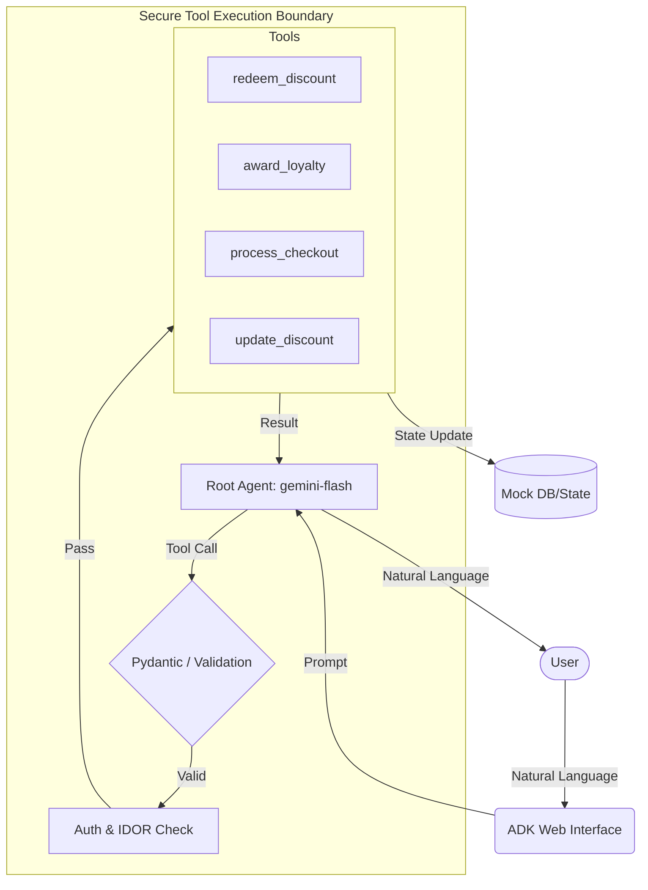

# 🛡️ Secure AI Shopping Assistant


Welcome to the **Secure AI Shopping Assistant** repository. This project demonstrates the secure lifecycle development of a generative AI agent using the Google Agent Development Kit (ADK), Test-Driven Development (TDD), and proactive security gating.

This project was built as part of the "Vibecode y protección del ciclo de vida de un agente de IA con Antigravity y TDD" lab.

## 🌟 Key Features
- **Generative AI Agent**: A fully functional retail assistant powered by Google's `gemini-flash-latest` model.
- **Dynamic Tool Calling**: The agent can autonomously execute business tools such as:
  - `redeem_discount_code`: Safe redemption with replay protections.
  - `award_loyalty_points`: Business state tracking and validation.
  - `process_cart_checkout`: Secure purchasing with Insecure Direct Object Reference (IDOR) protection.
  - `update_discount_status`: Administrative control via Role-Based Access Control (RBAC).

## 🏛️ Agent Architecture



## 🔐 Security Architecture
This project implements defense-in-depth methodologies:

1. **STRIDE Threat Modeling**: Analyzed system boundaries to identify and mitigate risks related to Spoofing, Tampering, and Elevation of Privilege (`threat_model.md`).
2. **TDD Planning Gate**: All agent tools were built using strict Test-Driven Development (TDD) via `pytest`. Tests explicitly validate security boundaries *before* implementation.
3. **Pydantic Validation**: Strong input typing and sanitization at the tool boundaries to block prompt injection and malformed LLM outputs.
4. **Local Security Gating (Pre-Commit)**: Integrated Git hooks utilizing `Semgrep` to automatically detect and block hardcoded API keys and insecure patterns before they leave the developer's machine.

## 💬 Example Interaction

**User:** *"Can you process the checkout for my cart? My user ID is user_123 and the cart ID is cart-001."*

**Agent (Internal Tool Call):**
```json
{
  "name": "process_cart_checkout",
  "args": {
    "user_id": "user_123",
    "cart_id": "cart-001"
  }
}
```

**System Boundary Validation:**
`Error: Unauthorized. Cart 'cart-001' does not belong to user 'user_123'.` *(IDOR Protection kicks in)*

**Agent Response:** *"I'm sorry, but I cannot process that checkout. It appears you are not authorized to access cart-001."*

## 🚀 Running Locally

1. **Install dependencies**:
   ```bash
   uv sync
   ```
2. **Authenticate with Google Cloud**:
   ```bash
   gcloud auth application-default login
   export GOOGLE_GENAI_USE_ENTERPRISE="TRUE"
   export GOOGLE_CLOUD_PROJECT="your-project-id"
   export GOOGLE_CLOUD_LOCATION="us-central1"
   ```
3. **Launch the Agent Playground**:
   ```bash
   uv run agents-cli playground --port 8081
   ```
   *Navigate to the provided localhost URL in your browser to interact with the agent.*

## 🧪 Testing

Run the full security and business logic test suite:
```bash
uv run pytest
```
